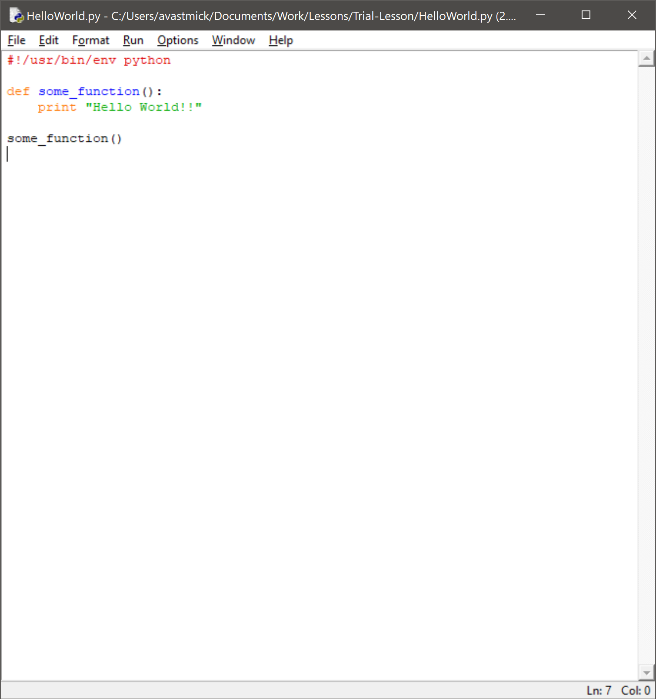
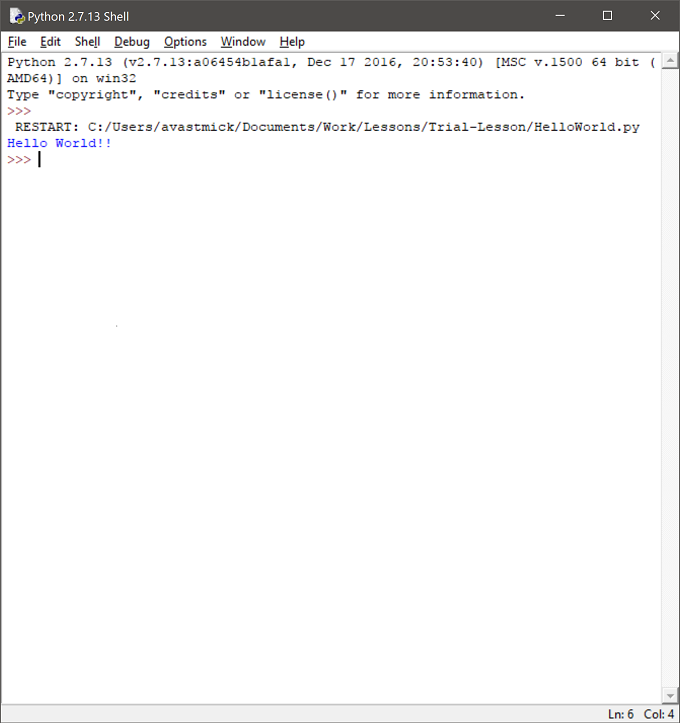

# Lesson One (1 hour)

A practical lesson as an introduction to learning Python.

# Objectives

- Understand what computers are for
- Understand how we can control computers
- Show example of how to instruct a computer using python
    + "Hello World!!" (standard)
    + Loops to output many times (intermediate)
    + Strings and manipulation (advanced)

## Class attainment

- **All** will know that computers automate work and that code instructs a computer
- Most will know how to write simple "Hello World" code in Python and save it to a file to reuse
- **A few** will be able to fix errors in their code
- **Some** will add to their code and do more in Python and solve logical problems in the code

# Opening [10 - 15 mins]

- Starter question - *"What you think is the purpose of a computer?"*
    + In pairs, discuss and come up with an answer. [Two minutes]
    + Round table, write on whiteboard answers.
    + Show how all the answers lead to the right one - **Automation of Work**
    + Computers do work we find boring or are repetitious.
- Follow up question - *"Give examples of the oldest computers."*
    + In pairs - [two minutes]
    + Round table, write up on whiteboard
    + **Neolithic standing stones** - they automated the calculations of the seasons for prehistoric people so they knew when to plant crops or go hunting.
    + **The abacus** - it automated the arithmetic of ancient traders.
    + Computers have been around a long time!!

## The rock computers of prehistoric people

Neolithic stand stones were actually the first computers humans built. They automated the calculations for when events occurred each year, like when Spring arrived, or when it was the best time to hunt.


## The wooden computers of ancient traders

The abacus was an old computer used to make difficult trading calculations easier to remember and record.


# Code (or Software) [5 mins]
- How do we get computers to do work for us?
    + **Code!!!**
    + Prehistoric people coded in rocks!
    + Ancient traders coded in wooden counters in racks!
    + Modern people code in text
- Code is the instructions for how a computer works
    + Code can be written in many languages
- How many computer languages can you name?
    + Scratch (You learnt this at school)
    + JavaScript (Most of the web is coded in this)
    + C / C++ (Often the basis of other languages)
    + Java (The most common language in the World)
    + C# (A common derivative of Java)
    + Logo (An older version of Scratch, used in schools)
    + Cobol (Most banks core systems are written in this)
    + Fortran (NASA still uses this for controlling rockets)

# Hello World [5 mins]

- When we learn a new computer language we must learn its "syntax" - this tells us what text we must write in order to give instructions to the computer.
- The first step in any language is to get the computer to say hello.
- Usually we get the computer to say ``Hello World!``

# Python [5-10 mins]

- Today we are going to instruct our computers by writing text in a language called Python
- Open a terminal on your computer
- Type in `python`
- You should see `>>>` appear
- Now type in ``print "Hello World!"``
- You should see the computer output ``Hello World!`` back
- Simple huh?
- Python is a very simple computer language
- Python is very efficient
- Python is very powerful - you can do pretty much anything with Python.
- So, what do you do when you want to write something complicated and use it again?

## Files [10 mins]

- You save your work in a file - like you would writing a document in Word or a PPT.
- The format of a python file looks like this:

```python
#!/usr/bin/env python

def some_function():
    print "Hello World!!"

some_function()
```

- Open an editor - Open Python IDLE (Python GUI)
- Add in the code
- Save the file 
- Name the file ``HelloWorld.py``



- Run the file by typing ``python HelloWorld.py`` or hit F5
- The output will be the same - ``Hello World!!``



- If you made a mistake, you may get an error...
    + What error did you get and how can you fix them?
    + Example: 
- Add an error - leave out a quote mark - and see what happens
- You may see an error for indentation

```python  
>>> print "Hello World!
  File "<stdin>", line 1
    print "Hello World!
                      ^
SyntaxError: EOL while scanning string literal
```

- What else? how about writing out "Hello World!!" 10 times to the screen?
- Or writing "Hello World!!" and remove a character each time so it disappears..?

## Loops [10 mins]

```python
>>> for i in range(1,10):
...     print "Hello World!!"
```


## String manipulation

- A String is a list of characters
- "Hello World!!" is a String
- Print out Hello World!! for the number of characters in its string
- Each iteration remove a character so the last iteration is blank

## Challenge

If you can solve this you get a prize!!

- Why does this code not do what you think?
- You'd think it meets the objective above, but it does not
- Why?

```python
hello = list("Hello World!!")
for i in hello:
    if i != hello[0]:
        del hello[-1]
    print ''.join(hello)
```

## Solution

```python
hello = list("Hello World!!")
strLth = len(hello)
for i in range(0,strLth):
    if i != 0:
        del hello[-1]
    print ''.join(hello)
```

# Summary [5 mins]

What have we learnt?

- What are computers for? - **Automation**
- How do we control them? - **Code (software)**
- We learnt some *Python*, a simple, but powerful computer language
- We learnt how to control the computer to say **"Hello World!"**
- We learnt how to save our instructions (our code) to a file to use again
- We learnt about errors
- We looked at some logical problems in code

## Look up:

If you enjoyed Python and want to learn more, have a look at the these links:

- <http://www.pythonforbeginners.com/basics>
- <https://www.codecademy.com/learn/python>
- <https://codefights.com>

## Notes on Github

Lesson plan and notes can be found at:

<https://github.com/avastmick/intro-computers-python/blob/master/Lesson-1.md>
